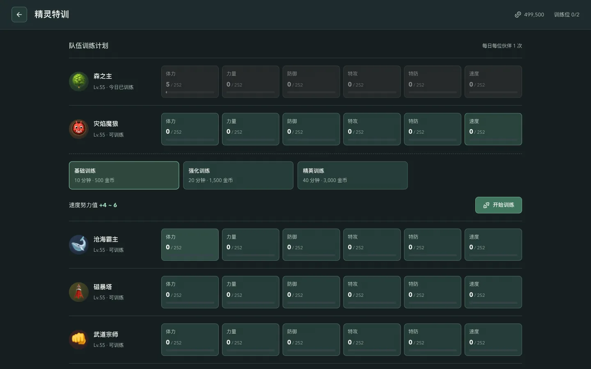
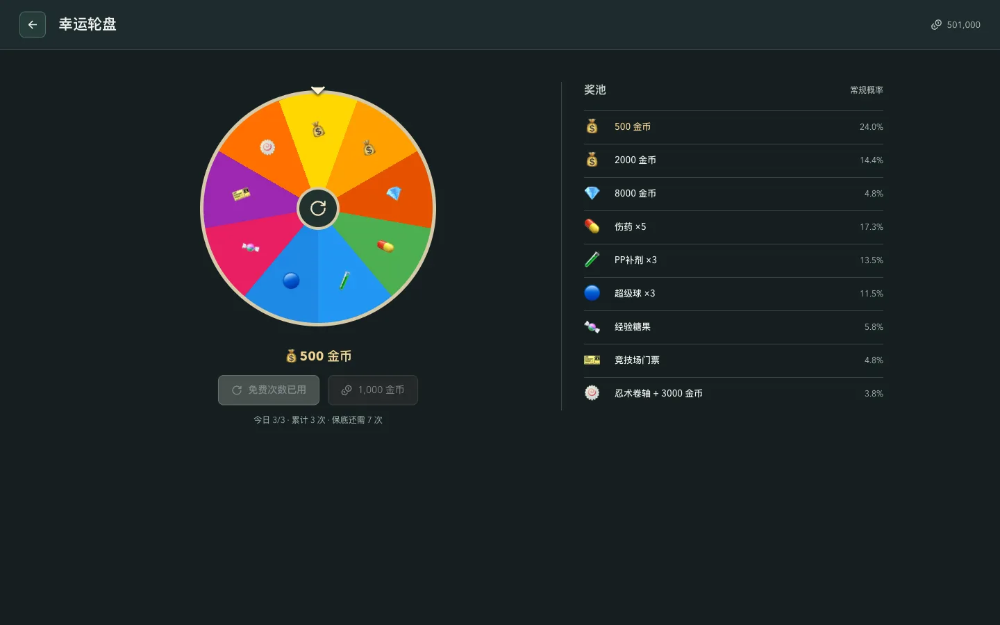
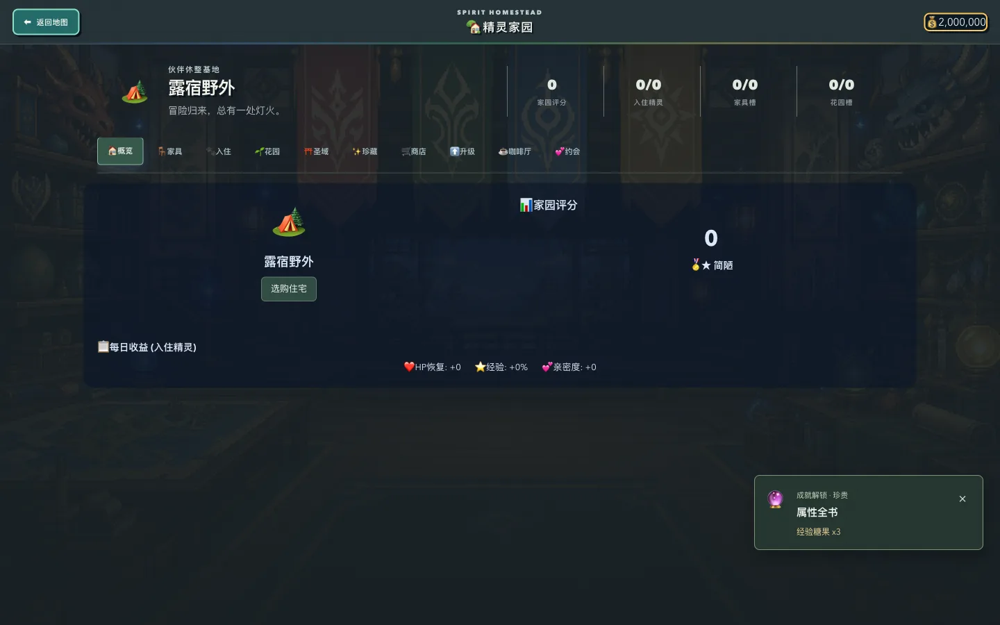
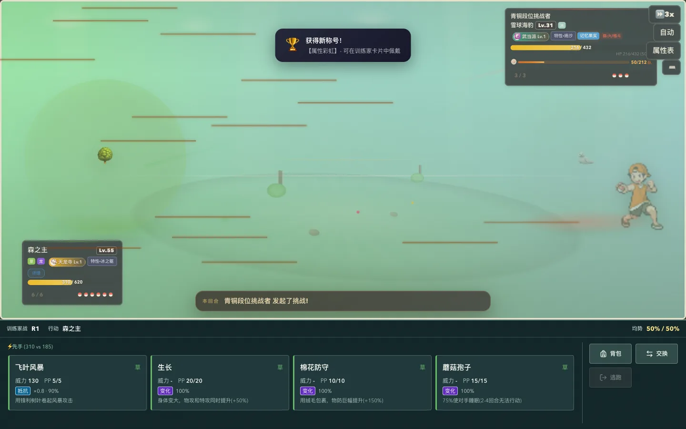

# 全玩法审查与 PC 界面统一

日期：2026-09-07。基线：主分支 `d9f5fdc`（PR #22）。测试使用独立的新档、中期档与后期档，不修改玩家存档。

本轮覆盖所有主要系统入口、代表性实际操作和共享规则，修复已确认的问题。浏览器操作、规则模拟与界面扫描分别记录；有限测试不能证明所有随机组合、长期剧情和无限模式都没有缺陷。

## 已修复问题

| 模块 | 问题与实际影响 | 修复 |
| --- | --- | --- |
| 单打回合 | 敌方先手或特殊行动提前恢复输入，外层回合尚未结算即可再次自动行动 | 完整回合持有输入锁，敌方独立回合仍正常释放；捕捉失败同样遵守交接 |
| 战斗恢复 | 多段动画累计超过 12 秒可能被误判卡死 | 仅在连续 12 秒没有动画推进时恢复，不打断正常长回合 |
| 忍者生存试炼 | 使用图鉴不存在的 `tier` 筛选敌人，候选池恒为空 | 按真实属性选取，通过精灵工厂生成等级、血量、技能和 PP |
| 竞技票 | 奖励及重新读档将超过 15 张的票券裁掉 | 奖励和购买可累计；每日免费补充最多补到 15，已有超额票不减少 |
| 挖矿与兑换 | 状态更新函数中发奖，重复调用可能多发或状态不同步 | 先纯计算并同步提交状态，再发奖；同帧重复地块被拒绝，满体力兑换不扣矿 |
| 幸运轮盘 | 旋转终点与实际奖品不一致 | 每次累计旋转并准确停在奖品扇区；显示常规概率、保底距离和每日次数 |
| 精灵特训 | 不可训练原因不清楚，倒计时与真实收益难比较 | 六属性队伍列表、每秒倒计时、费用与 EV 范围；明确濒死、派遣、每日次数、EV 满值 |
| 精灵竞速 | 濒死伙伴可报名，高等级对手名称与进化后形态不一致 | 报名复核当前队伍，显示真实形态和等级 |
| 道具标注 | 伤药和好伤药图标仍标旧药效 | 直接读取实际药效，分别显示 35 和 80 |
| 家园 | 未购房引导去家具商店；稀有库存种子无法种；星辰果发错奖励 | 直接选购住宅，稀有种子可用库存种植，星辰果正确发极限糖果；花卉显示真实放置评分 |
| 家园操作 | 家具和咖啡派工不能用键盘；主题覆盖进度条 | 支持 Enter/Space，状态条改为独立原生进度条，修复背景优先级 |
| 成就通知 | 高进度档连续全屏通知阻挡继续游戏 | 右下角非阻塞通知，战斗期间不显示 |
| 联盟 | 支线章节被当作主线进度，可提前绕过报名门槛 | 报名与按钮均读取主线进度；徽章总数不再显示 24/13 |
| 门派日常 | 随机第一项被改成挑战任务，产生重复 ID、错误目标和奖励 | 仅改真实挑战任务文案；按权威任务表修复旧档，在推进前合并重复进度并保留已发奖状态 |
| 宝藏迷宫 | 体型限制只在入场失败后提示 | 卡片预先显示限制及不合格原因，入口支持键盘 |
| 跨体系秘境 | 漏发忍术熟练奖励，阶段重复使用整份通关金币 | 按低熟练优先发奖且单项不超 100；阶段仅发明确掉落，通关奖最终一次；回到同一战术室页继续下一阶段 |

## 实际操作覆盖

浏览器使用可见 Chromium。每日限制、成熟时间和动画场景使用受控浏览器时钟；战斗按连续时间推进，不直接篡改胜负或结算函数。

| 系统 | 本轮浏览器操作 | 边界与证据 |
| --- | --- | --- |
| 首页、新档、存档 | 姓名变更、15 批初始伙伴、选取后进入地图、存档重载、活动门槛 | 同批基础战力最大差 1.1183 倍，阈值 1.12 |
| 战斗与技能栏 | 竞技场入场、Enter 出招、回合结算、背包、换人面板、自动强制换人 | 4 技能与 8 技能布局；双方先手另有真实函数回归 |
| 普通副本 | `mist_forest`、`speed_run`、`wild_survival`、`memory_trial`、`type_challenge`、`boss_rush`、`stone_tower`、`hero_trial`、`ladder_trial`、`type_roulette`、`shiny_valley`、`reverse_world`、`double_arena`、`elite_rotation`、`safari_zone`、`ragnarok`、`survival_arena`、`extreme_trial`、`treasure_maze` 均进入实战并完成被测结算 | 无尽波次采用代表波次，不代表全部波次完成 |
| 其他挑战 | 属性/双打试炼、咒术、竞技场、世界首领、忍者首波、联盟一轮、无限城首层、门派守关 | 联盟门槛另用不合格支线档验证 |
| 日常 | 挖矿、兑换、赏金、特训启动领取、远征、三次轮盘、五场竞速 | 核对扣费、计次和重复操作；竞技票 35→43，读档仍 43 |
| 家园花园 | 购帐篷、购买/放置/收回家具、入住、种植、重复浇水、稀有种子种植及成熟收获 | 普通流程扣 3300；成熟格只消费一次 |
| 咖啡约会 | 购买、键盘派工、酿造、重复点击领取、下班、打开约会页 | 扣 8500、饮品只领取一次；婚姻未逐日人工推进 |
| 帮派国战 | 加入帮派、日领、捐献、任务、征兵、国战日收及分页 | 多赛季和攻城组合采用规则模拟 |
| 生态 | 观察、救助入口和收益、分页 | 区域连锁、危机、灵灾结算另有规则回归 |
| 电脑融合 | 存入/取出保持 UID 和队伍数；选择父母、融合生成、扣费 | 六只合为五只；占用和资产保护另有规则回归 |
| 战术室秘境 | 流派选择；封印之森解谜、守卫战、首领战完整通关 | 核对持久通关标记及忍术熟练奖励 |
| 果实与对战码 | 装备橡胶果实核对背包及伙伴，详情卸下；生成、复制、解析、导入六人对战码并进入实战 | 本轮未打完整场 PvP；卸下后的持久化由规则检查覆盖 |
| 辅助界面 | 22 个主入口扫描、39 张基础截图，含资料、成就、图鉴、果实、忍术、技能、名将、说明、设置和背包分类 | 扫描用于显示检查，不等同玩法结算 |
| 系统分页 | 家园 10 页、帮派 7 页、国战 12 页、战术室 10 页、门派分页 | 门派高阶入口用后期档另行验证 |

## 设计与平衡判断

- 保留属性克制、队伍搭配和资源约束，不因单场胜败整体削弱敌人。
- 免费票补充上限区别于持有量，秘境通关奖区别于阶段奖，经济规则与实际呈现一致。
- 竞速最快伙伴冠军率约 50.8%，付费金币期望 2825，低于 3000 门票；速度选择有意义，但不会稳定夺冠。
- 训练单项 EV 上限 252、总和上限 510，高档训练交换时间效率，不绕过总成长上限。
- 名将、国战、帮派、生态、基础经济、跨体系六组平衡检查通过。国战检查行动次数、兵力收支、围城进度及多赛季分布。
- UI 使用炭灰底、柔白字及绿/珊瑚/金色状态；收敛标题、阴影、圆角和多重框体，训练和轮盘重新组织比较结构。
- 保留 PC 专用入口：移动设备不挂载游戏，触屏 Windows 电脑仍可进入。新增布局只面向 PC 窗口。

## 验证结果

| 检查 | 结果 |
| --- | --- |
| `npm run check:regressions` | 131 项通过，含本轮奖励、旧档、并发交接与状态修复 |
| `npm run check:balance` | 六组全部通过 |
| `npm run build` | 生产构建通过；入口 JS 合计约 3.90 MiB，未压缩口径 |
| `git diff --check` | 通过 |
| PC 技能栏 | 1440×900、1280×720、1024×768、1920×1080、2048×986、1280×600 通过；8 技能额外检查 3 种尺寸 |
| 新档 | 姓名、初始强度、存档、活动门槛、PC 专用入口通过 |
| 双打与展开战术信息 | 目标选择、第二行动位及展开战术信息通过，无布局遮挡 |
| 加载与网络恢复 | 图片请求全部挂起仍可新建、读档和进入地图；脚本失败可重试且保留存档；慢脚本恢复后正常进入 |
| 冷启动 | 本机 1 Mbps、150 ms 延迟、禁用缓存，首页可交互约 9.83 秒；图片全部挂起时约 0.30 秒，不代表所有真实网络 |
| 桌面文件入口 | 生产分包在 `file://` 下可进入新档；移动端不挂载游戏 |

既有 Node 模块类型提示不影响检查结果，本轮未为消除提示修改整个项目的模块类型。

## 界面截图

## 测试边界

未穷尽全部剧情分支、婚姻逐日过程、无限城路线、每个国战赛季，以及全部技能/装备/天气/果实组合。这些系统检查了入口、代表流程和共享规则；不能据此声称游戏不存在任何剩余问题。

后续值得继续投入长档试玩和入口代码拆分，分别衡量长期成长节奏与弱网冷启动下载量。
