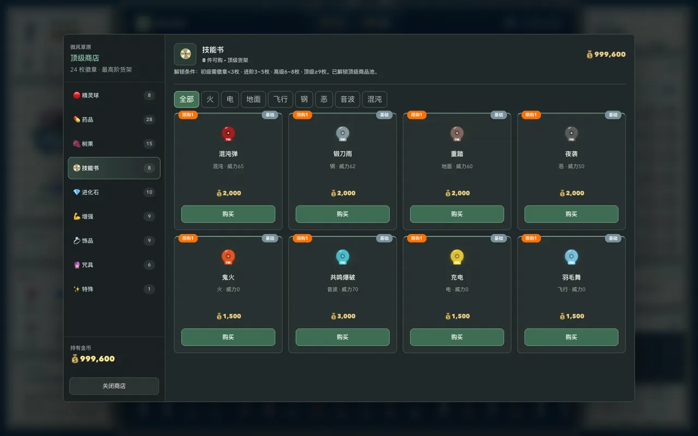
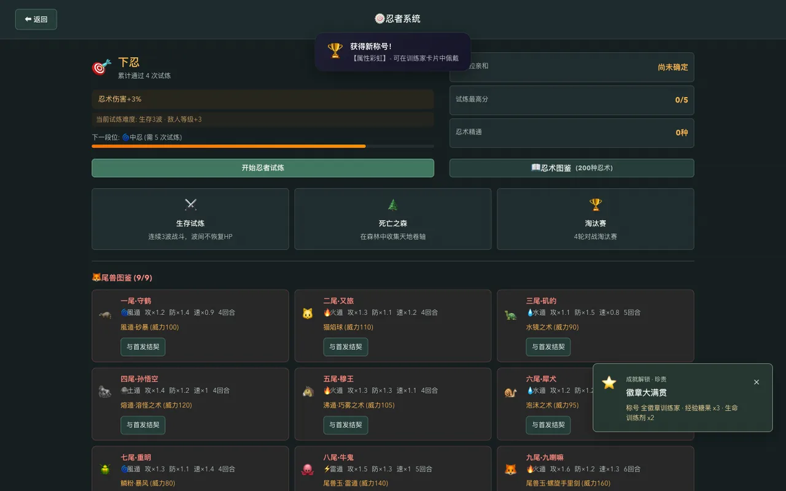
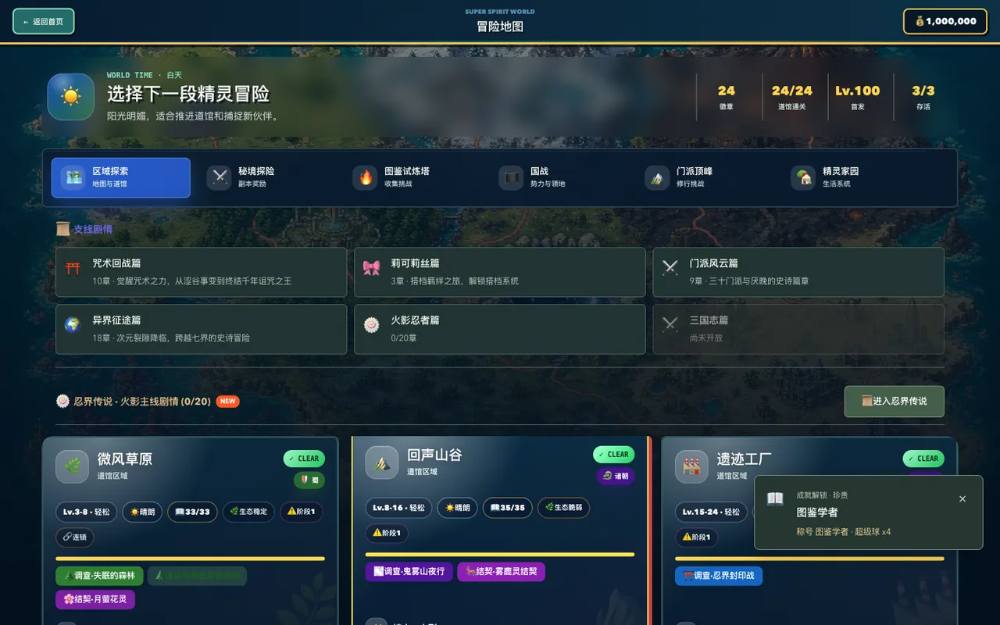

# 全系统复查与 PC 体验优化

## 2026-09-08 追加复查

本次追加将怪兽图鉴扩展到 400 种，并新增 8 个有押金、失败惩罚和首胜奖励的灾厄讨伐；93 位奥特曼全部绑定独有变身器（其中 44 件为明确标注的原创设计），所有变身器图片统一为 384×384 深色背景。905–1000 号精灵改用 96 张不与前 904 号重复的宝可梦官方图标。

战术室现在保留全队已装配的变身器显示，查看其他伙伴不会误报“选择宿主”；装备栏显示实际附带技能；没有可用忍术时自动回到本体技能页。联合冒险使用真实阶段进度字段，门派、徽章、资源、冷却和存活队伍条件与执行函数一致，奖励预览覆盖兵力、守护积分、名将碎片、门派贡献和残页。

追加验证：93 张变身器图片逐角检查背景像素和文件哈希；96 张精灵图逐张加载；奥特曼收藏四种 PC 尺寸无横向溢出；39 个主要入口、49 个系统页、21 个副本入口、12 个国战页签无页面异常；讨伐平衡脚本覆盖 8 个讨伐、240 个单打/双打样本。完整覆盖仍受随机队伍、未来赛季和实际玩家操作时长限制。

基线：`8df8ee9`（PR #28）。测试均使用独立存档，不修改玩家实际存档。

## 检查清单

本轮按以下25组系统复查。状态区分代码与规则检查、浏览器实际操作、长档模拟。通过某一项不代表该系统的所有状态已穷尽；前两轮的代表性完整流程见[全玩法审查](full-gameplay-audit-2026-09-07.md)与[长档审查](longrun-audit-2026-09-07.md)。

| 系统 | 本轮状态 | 检查重点 |
| --- | --- | --- |
| 首页、新档、PC 平台限制 | 共享回归与浏览器通过 | 生产构建可进入新档；手机被拦截且不下载主体 |
| 世界地图、移动、天气、昼夜 | 规则与实际操作通过 | 地图入口、24徽章目标、生态、天气与遭遇 |
| 主线、支线、三国与生态剧情 | 长档规则通过；修复入口 | 53个已接入主支线章节；另检查12个三国志数据章节，后者尚未开放 |
| 单打、双打、自动战斗 | 规则与双打实操通过 | 指令撤回、键盘目标、共享资源、变身与特效 |
| 技能、学习、遗忘、技能书 | 基线通过 | 效果继承、待学队列、PP |
| 果实、忍术、尾兽、咒术、呼吸 | 基线通过 | 解锁、组合、资源与互斥 |
| 奥特曼、怪兽、契约试炼 | 专项规则通过；入口实操 | 93英雄、165形态、248怪兽、279路线与难度奖励 |
| 精灵养成、进化、洗练、觉醒 | 已修复并回归 | 两套道具入口、批量升级、条件与求婚任务进度 |
| 队伍、电脑、放生、融合 | 基线通过 | UID、占用保护、资产返还 |
| 背包、商店、装备、遗物 | 已修复并实操 | 9类商店、10类背包；属性覆盖、数量扣费、饰品限购 |
| 普通副本与特殊规则副本 | 21配置入口逐个实操 | 20普通配置和百鬼夜行进入战斗/无限城；共享连战结算回归 |
| 无限城、路线、祝福与变异 | 基线通过 | 续跑、深层、结算、真实战斗 |
| 竞技场、联盟、塔、世界首领 | 基线通过 | 门槛、赛季、失败恢复、零掉落 |
| 捕虫大会、钓鱼、华丽大赛 | 已修复并实操 | 钓鱼失败重试与成功、华丽5轮领奖；捕虫物种选择与结算回归 |
| 特训、远征、赏金 | 已修复并实操 | 远征派遣、占用、40%分支、归队领取；其他共享规则通过 |
| 轮盘、竞速、矿洞与兑换 | 基线通过 | 概率、付费期望、同帧操作 |
| 住宅、家具、花园与宝藏 | 基线通过 | 品质、放置、成熟与收益 |
| 咖啡、约会、求婚与婚姻 | 基线通过 | 207 天模拟、库存、跨系统任务 |
| 门派、日常、首席、掌门与秘境 | 基线通过 | 原子扣费、连续挑战、武学 |
| 帮派、任务、技能与帮战 | 基线通过 | 难度提示、权威队伍、奖励 |
| 国战、名将、外交、攻城与赛季 | 基线通过 | 四阵营、兵力、战役、重复结算 |
| 战术室、跨体系秘境与觉醒 | 基线通过 | 阶段、通关、技能熟练、门槛 |
| 生态巡护、救助、危机与灵灾 | 基线通过 | 因果连锁、净化、胜负 |
| 图鉴、成就、资料、回放与排行 | 入口与共享回归通过 | 真实统计、领取、试炼键盘入口与长文本布局 |
| 游戏说明、设置、音频与存档 | 已校对并回归 | 比赛、远征、门槛、商店和未开放篇章；备份与恢复 |

## 已修复问题

| 问题 | 修复与设计取舍 |
| --- | --- |
| 钓鱼旧计时器可影响新竿；页面退出后仍可能回调 | 取消计时器并校验竿次；600毫秒绝对截止时间，后台定时器延迟不能延长反应期；原生按钮支持键盘 |
| 捕虫/钓鱼每次报名重置历史，使防连续重复抽种失效 | 同一会话内保留上一物种；重开游戏不跨存档保留历史 |
| 华丽大赛可选濒死首发、陈旧状态可能产生额外轮次 | 选第一只存活伙伴；同步状态限定5轮，只接受参赛者已有招式；展示真实分数区间和重复扣分 |
| 背包糖果路径漏记求婚升级任务 | 单次、批量和神奇糖果按实际升级数记一次；维生素、等级封顶和重复确认不虚增 |
| 收满24徽章仍指向低等级地图，目标总数曾按20计算 | 根据真实带徽章地图找下一目标；主线13枚与全部24枚分别计数，完成后提示终局挑战 |
| 忍者试炼只由鼠标遮罩限制徽章，濒死队伍可消耗当日机会 | 处理函数要求3徽章与3只存活伙伴；按钮展示具体未满足条件，难度波数来自当前段位 |
| 技能书货架固定遍历前八个属性，后续属性长期不上架 | 地图种子先打散属性再选招式；每图稳定8项，45张地图覆盖全部可售属性，过滤器只显示本店属性 |
| 饰品列表不认识对象格式，限购忽略仓库伙伴装备 | UI与购买处理共用持有量规则，包含背包、队伍和仓库；不能通过存入电脑重复购买 |
| 远征可选无效队员、提交失败清空选择、过早决策与奖励误导 | 明确濒死/占用/每日6次/同时3队；拒绝部分无效队伍；40%权威时间门槛；显示风险和真实倍率范围，矿石每项至少1份 |
| 火影剧情快捷入口显示未开放，部分试炼卡片缺少键盘操作 | 直接进入现有20章忍界剧情；三国志独立篇明确尚未开放；支线与图鉴试炼支持Enter/Space |

视觉上重做钓鱼与华丽大赛的舞台、成绩与奖项布局；忍者首页把试炼行动提前、尾兽改为网格；商店、远征、支线、秘境和图鉴试炼收敛边框与色彩，保留属性/难度识别。商品长描述完整换行，图鉴头像固定尺寸，去除放大后超出容器的比赛头像背景。比赛组件与评分、商店选品规则拆到独立文件。

## 验证证据

| 检查 | 本轮结果 |
| --- | --- |
| `npm run check:regressions` | 131项通过；旧远征断言从静默裁剪更新为完整队伍校验 |
| `npm run check:systems` | 新增13项真实处理函数/纯规则回归，4000次华丽评分模拟 |
| `npm run check:balance` | 名将、国战、帮派、生态、经济、跨体系六组通过；修改远征后另跑经济检查通过 |
| `npm run check:longrun` | 七组通过；8名婚恋角色各207模拟天、18生态结局、无限城浅深层、4阵营各52赛季 |
| 战斗组合长档 | 1753条技能池记录，352353次实际行动，552146个定义矩阵中的两两交互；含200果实、96装备、5天气 |
| `npm run check:battle` | 19项通过 |
| `npm run check:ultra` | 16005个案例通过，覆盖93英雄/165形态 |
| `npm run check:kaiju` | 248物种、4960次招式执行、279路线、18000遭遇；248种均可达 |
| 浏览器入口与分页 | 37主/活动入口，商店9、家园10、背包10、战术室10、国战12页；无页面异常或文档横向溢出 |
| 浏览器具体操作 | 商店买2球、持有30变32并扣400金币；钓鱼提前收竿/重试/键盘成功/领奖；华丽5轮/评分/领奖；远征派遣/占用/分支/领取 |
| 浏览器副本 | 21个配置逐个进入对应战斗或无限城；英雄试炼用单人、其他用合格队伍，首发等级100 |
| 浏览器双打 | 1440×900、1280×600、1024×768；4槽位可见，指令撤回、第二目标键盘选择、变身、光线、减少动态效果；Canvas像素非空 |
| 构建 | 生产构建通过；首页初始JS约166KiB，游戏主体约2.07MiB（未压缩），没有因本轮额外加载怪兽全图 |
| 启动验收 | 本地生产预览的新档、手机限制、首页不加载奥特曼肖像、入口与主体文件哈希均通过 |

本轮浏览器使用可见Chromium与隔离存档；比赛NPC位置使用固定地图存档，调用的仍是实际移动、报名和结算；等待类操作使用受控浏览器时钟，战斗特效按真实时间运行。长档剧情的胜负和部分任务由事件注入；不能把这类规则测试称为数千天人工游玩。

华丽大赛采用两种合适招式交替时，2000样本均分约170.12，连续重复同一招式约130.12，最高190分奖达到113/2000（5.65%）。保持最高奖挑战性，没有为了验收调高得分。远征补偿只对原本可能取整为零的矿石设最低1份，其他收益和每日次数不膨胀。

## 界面证据

## 边界与后续

- 已修复本轮确认的问题；测试通过不能证明没有剩余缺陷，也不能穷尽所有队伍、随机时序和未来赛季。
- 三国志独立12章当前只有数据，未接入正式玩法。此前65章长档统计包含53个已接入章节与这12个数据章节；国战战役、名战和赛季是另一个可用系统。
- 本轮21秘境逐一验证入场，最终连战结算沿用共享回归和上一轮完整代表流程；没有重打所有无限波次。
- 道具、门派、家园等未改动系统复用了已有共享回归；本轮分页检查不冒充每个子操作都再次完成。
- 长期成长与国战仍应补真实玩家战斗时长、失败率与干预样本。入口主体仍较大；本轮保留首页分包并拆出比赛组件，没有重测三次弱网基准，不宣称解决全部冷启动下载量问题。
