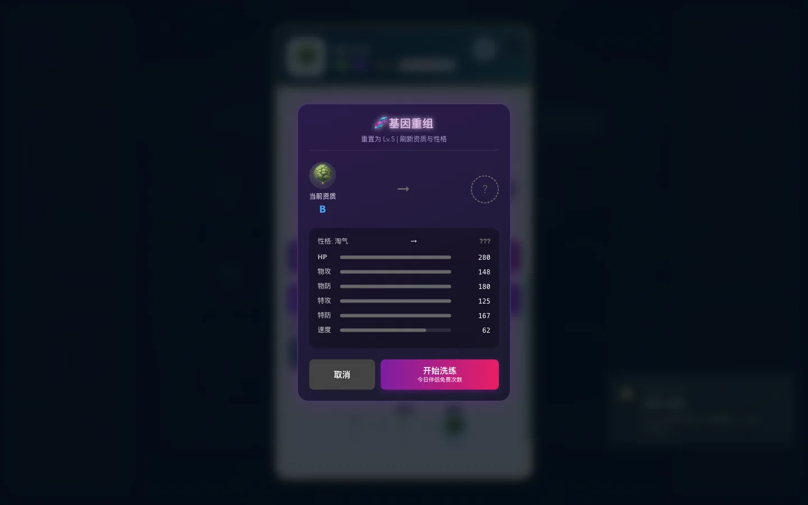
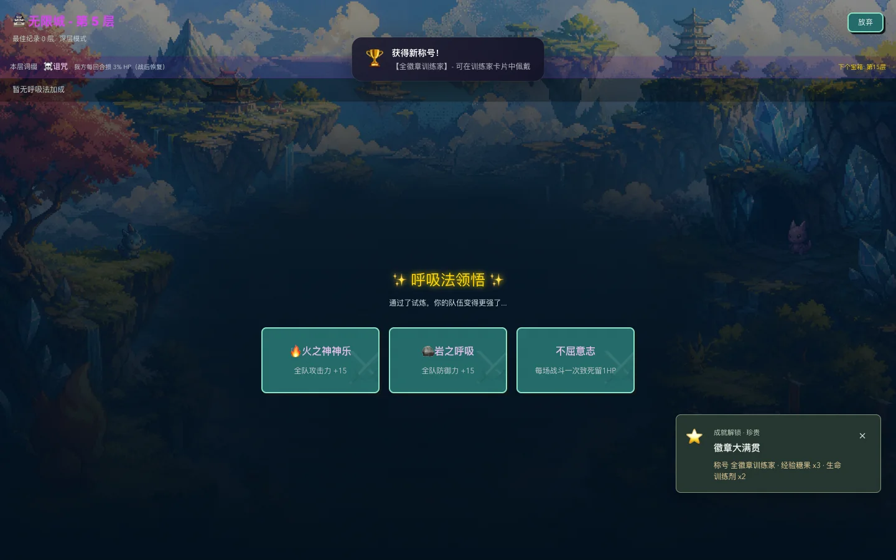

# 长档、剧情分支与组合规则审查

日期：2026-09-07。基线：`d091c6a`（PR #23）。本报告承接[上一轮全玩法审查](full-gameplay-audit-2026-09-07.md)，补充此前没有逐项验证的长期状态与分支规则。所有浏览器验证使用独立存档，不修改玩家的实际存档。

## 修复结果

| 模块 | 已确认问题 | 本轮修复 |
| --- | --- | --- |
| 婚姻阶段 | 好感达到 1000 就被识别为已婚，实际尚未求婚 | 好感阶段保持恋人，完成婚礼才进入已婚阶段 |
| 礼物与约会 | 糖果、营养品、球、技能书和字符串 ID 饰品无法送出；部分喜好无法命中；约会事件可重复结算或覆盖 | 按真实库存生成礼物，结构化匹配喜好，准确扣除物品；待选择约会使用同步引用保护 |
| 求婚任务 | 捕获同一种精灵可以重复累计“不同种类” | 按物种 ID 去重，不同种类才推进 |
| 配偶收益 | 冷却倍率越升级越差；每日免费洗练没有生效；部分品质与家园收益只存在于说明中 | 冷却、闪光倍率围绕 1 缩放，整数次数取整；免费洗练每日真实消费，直接洗练、预览和按钮共用费用；接入花卉、家具品质、家具评分、野外 IV 和饰品掉落品质 |
| 剧情分支 | 宽泛结局先匹配，遮住具体结局；选路线跳过探索；分支数值不足以触发配置结局 | 优先匹配具体条件，逐步持久化非战斗流程，补齐路线决策增量；拒绝陈旧推进与非法选项 |
| 无限城路线 | 临时伙伴经过非战斗路线就消失；重复点击可重复推进；快捷入口绕过十层首领；恢复不记入条件 | 临时伙伴保留至下场战斗，路线与奖励验证当前层和状态；移除绕过入口，恢复记录 `healUsed`，应用路线掉落倍率 |
| 无限城技能 | 变异反复堆叠到同一技能，零威力技变成攻击；吸血和沉默未实现 | 四种变异分配给不同攻击技，每技一次，威力封顶 250；吸血恢复实际伤害的 20%，沉默 15% 阻断下次行动；全部解锁后训练恢复 PP |
| 无限城祝福 | 部分开放祝福只有不符文案的隐藏 12% 增伤 | 实现火系灼伤、冰系冰冻、草系阻断、雷系概率增伤、地面物理减伤与治疗护盾；验证暴击连锁和不屈意志；移除隐藏通用增伤 |
| 无限城旧档 | 待领奖池含无效 ID 时卡在空白奖励页；无效、重复祝福占用槽位 | 读档及活动入口均修复奖励池；清理未实现祝福与重复变异；可选收益全部饱和且无需治疗时进入下一层 |
| 技能书 | 生成与学习丢失命中率、效果、反伤、自爆、蓄力和先制等属性 | 提取技能书工厂，完整继承战斗字段，只在学习时移除商店元数据 |
| 国战 | 陈旧赛季可重复结算；四个可选阵营初始城数不等；战役忽略 `teamSize` 固定六人 | 拒绝旧赛季奖励，四阵营各五城；32 个战役按配置生成四、五、六人，首领保持末位 |
| PC 启动 | 首页等待全部游戏代码，弱网期间长时间没有可用入口 | 首页独立加载并预热主体，显示进入状态及失败重试；小图先显示，大封面可取消下载；PC 浏览器基线减少旧兼容代码 |

“扩幅”和“爆裂种子”明确表示威力增加 5% / 10%，不再宣称尚不存在的范围攻击或延迟爆炸。未开放祝福仍保留数据定义，但不会进入可领取奖池。水系治疗护盾与通用治疗护盾不叠加。

## 规则与长档覆盖

测试通过 AST 提取项目的真实处理函数和依赖，动画、等待与展示日志使用空操作。提取器只接受模块级或 `RPG` 直接作用域，防止同名 UI 内部函数覆盖实际战斗逻辑。默认随机种子为 `90412`；国战四阵营分别使用 `90412` 至 `90415`，婚姻使用角色 ID 长度作为种子。日期模拟从 2026-01-01 开始。

| 系统 | 已执行范围 | 验证方式与边界 |
| --- | --- | --- |
| 婚姻 | 8 个角色各 207 天、18 个约会选项，含每日限制、礼物、求婚、婚礼、婚后收益、离婚与冷却 | 调用真实处理函数，资源充足且解锁条件满足；探索、战斗、捕获等任务由事件注入，不是 1656 天真人游玩 |
| 生态剧情 | 59 个路线与决策组合，全部 18 个配置结局可达 | 逐步骤调用实际流程，验证存读档、分支合法性、奖励与重复推进；不包含所有外部世界变量和随机历史 |
| 主线、支线、三国剧情 | 65 章节、318 任务、438 次胜负结算检查 | 章节编号跨篇复用，按地图和标题区分；验证实际结算函数，战斗结果作为事件输入 |
| 无限城 | 浅层、深层各 1000 层，全部 11 种路线出现，全部开放奖励逐项领取 | 胜利事件注入；检查路线、奖励、防重、临时克隆回收和 JSON 存读档，不代表打赢 2000 层 |
| 无限城战斗 | 9 种开放祝福、2 种有附加效果的变异 | 直接调用 `performAction`，覆盖触发、免疫、阻断消费、一次性限制、治疗护盾及物理/特殊分流 |
| 国战 | 4 阵营各 52 个七天赛季，共 208 赛季、29120 tick，使用 550 名将真实数据 | 每天存读档，检验城池、兵力、贡献继承、排名与重复领奖；玩家静置，AI 推演，不是攻城胜率 |
| 国战战役 | 32 个战役，各三个随机边界，共 96 个队伍 | 调用真实队伍工厂，验证人数、首领、等级和可用技能 |
| 技能书 | 472 条技能书 | 核对生成、学习后的真实战斗字段继承 |
| 战斗组合 | 1741 条技能池记录、200 果实加无果实、96 装备加无装备、5 天气 | 349941 次实际行动，覆盖定义矩阵中的全部 548510 个两两交互；断言真实 PP 消费、HP 与属性有限且非负 |

技能池记录包含跨池重复和变体，并非 1741 个独立技能：普通 485、状态 50、附加效果 46、觉醒 26、果实 200、忍术 200、咒术 116、武学 120、技能书 472、攻击型组合忍术 26。组合测试每次行动从健康状态开始，资源足够施法，轮换一项无限城祝福；这组断言检查规则稳定性，不能证明所有伤害数值都平衡。

## 成长与平衡观察

婚姻在每天使用充足资源推进的前提下，第 7 至 8 天可求婚，第 11 至 16 天完成婚礼。这是解锁后最快日常节奏样本，不包含准备金币、住宅、礼物和地图进度的时间。

成长测试从 5 级起，每次同级敌人，每六次一次训练家战斗，没有经验增益，调用真实经验结算函数。下表为全队均达到目标等级所需的击败次数，不是现实游玩分钟数。

| 队伍方式 | 20 级 | 40 级 | 60 级 | 80 级 | 100 级 |
| --- | ---: | ---: | ---: | ---: | ---: |
| 单人 | 19 | 50 | 98 | 171 | 290 |
| 六人固定首发 | 56 | 145 | 297 | 581 | 1316 |
| 六人轮换 | 75 | 191 | 377 | 656 | 1113 |
| 六人双打轮换 | 64 | 164 | 324 | 568 | 966 |

轮换队伍的后期整体成长快于固定首发，但早中期全员里程碑并非始终更快。缺少真人完整成长档的战斗时长和失败率，本轮不据此整体修改经验曲线。

208 次静置赛季的冠军分布如下。调整初始城池后吴方劣势有所缓解，晋方仍占优；不能把城数一致等同于地图和玩家策略完全平衡。

| 初始配置 | 魏 | 蜀 | 吴 | 晋 | 群 |
| --- | ---: | ---: | ---: | ---: | ---: |
| 调整前 | 50 | 45 | 14 | 75 | 24 |
| 调整后 | 44 | 45 | 33 | 68 | 18 |

## 浏览器与冷启动

可见 Chromium 使用独立后期存档，真实点击送橙橙果（好感 1000 到 1020、库存减一）、求婚、逐句婚礼、免费洗练和旧无限城待领奖。洗练无药时第一次成功，第二次被禁用；无效奖励池自动恢复，Enter 领取后到第六层。无页面运行错误。婚礼用已满考验存档开始，未在浏览器里逐日积累所有考验。

同机 Chromium，gzip、1 Mbps（125000 字节/秒）、150 ms 延迟、禁用缓存，各重复三次取中位数：

| 指标 | 基线 | 本轮 |
| --- | ---: | ---: |
| 首页可操作 | 9.805 秒 | 0.811 秒 |
| 首页出现后立即点击，到进入新档界面 | 0.109 秒 | 9.373 秒 |
| 从导航到进入新档界面 | 9.919 秒 | 10.184 秒 |
| 首页初始 JS，gzip | 1159356 字节 | 56421 字节 |

本轮测量产物的首页初始 JS 约 166 KiB（未压缩），此前约 3.90 MiB。首页更早可用，但主体总进入时间没有明显缩短，样本反而约慢 0.265 秒。大多数代码仍在动态主体和数据包中；提前预热、进入状态与重试改善了等待反馈，不能视作下载量问题全部解决。最终旧祝福迁移调整仅影响主体少量字节，未重测该三次基准。

1024、1280、1920 宽 PC 首页，分包下载失败重试、`file://` 新档入口、手机拦截且不下载主体均通过。继续保留触屏 Windows PC。截图在入场动画结束状态采集并人工复核：

## 复验与剩余边界

- `npm run check:longrun`：七组通过，包括修正 AST 作用域后的完整重跑；最终旧档迁移调整另重跑无限城组。
- `npm run check:regressions`：最终代码 131 项通过。
- `npm run check:balance`：名将、国战、帮派、生态、经济、跨体系六组通过。
- `npm run build` 与 `git diff --check`：通过。
- 浏览器实际操作、弱网与故障重试另行验证，不能用规则模拟代替 UI 测试。

完整四维笛卡尔积为 169721385 种，本轮执行两两覆盖而非全部四维穷举。双装备槽组合、敌我不同果实、完整队伍排列、控制时序、所有随机序列及无限未来赛季仍未穷尽。剧情测试覆盖当前配置的路线与结局，不覆盖所有跨系统世界状态。当前结果不能证明游戏没有剩余问题。

后续应结合真实长档的战斗耗时、失败率和资源获得速度继续调节成长；国战需要更多地图与玩家干预样本；入口主体仍需按视图进一步拆分，持续比较首页与进入游戏两个指标。`App.js` 仍是大型模块，本轮只拆出启动、技能书、战役生成和部分无限城战斗规则。
