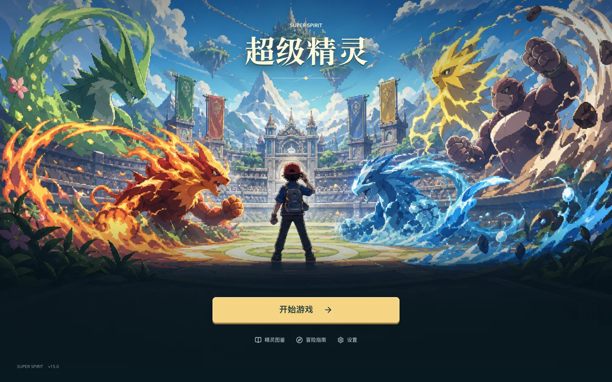

# PC 游戏体验与修复记录

本轮范围为 PC 浏览器版。使用独立测试存档体验模块，没有覆盖真实玩家存档。手机和平板不会挂载游戏，仅显示电脑访问提示；触屏 Windows 电脑仍可正常进入。

## 首页

首页改为完整场景主视觉。新玩家显示“开始游戏”，已有存档显示“继续冒险”；保留训练师、地区、徽章摘要，以及图鉴、指南、设置入口。重置存档仍须二次确认。移除首页重复的指挥台、培养进度、资源统计和玩法卡片，其他玩法通过游戏内原有导航访问。

## 修复与设计调整

| 模块 | 问题与结果 |
| --- | --- |
| 初始伙伴 | 推荐按实际战斗属性筛选，优先保证同批总属性差不超过 12%，同时保留属性多样性；候选不足时选择差距最小的一组。 |
| 创建存档 | 选择伙伴前修改名字会正确保存；重复确认不会再次创建初始伙伴。 |
| 全队治疗 | 使用权威药效 35/80/200/9999；普通药不能复活；按队伍顺序为每位存活伙伴选择足量且道具价值较低的组合。 |
| 治疗预览 | 确认前显示恢复 HP 和消耗，确认时复核最新库存；避免重复扣药，正确记录无限城本次用药状态。 |
| 地图输入 | 输入框、活动、生态、确认等弹层打开时不再误移动；地图区域和伙伴支持键盘进入，待学技能优先处理。 |
| PC 布局 | 修复伙伴窗口入场偏移；商店分类可独立滚动，关闭入口在较小 PC 窗口内可见。 |
| 活动中心 | 未达到徽章条件的竞技场、矿洞、特训、首领、竞速显示解锁条件，不计为待处理活动。 |
| 竞技场 | 补齐赛季奖励导入，修复进入页面崩溃；预览遵循等级封印、属性限定和实际进化形态；赛季天数按自然日计算。 |
| 战后邀请 | 修复帮主战胜可招募训练师后访问未定义剧情标记的问题。 |
| 开发预览 | 修复 Webpack 开发服务器误读旧 dist 构建；生产资源继续兼容 GitHub 子路径和 Electron file 协议。 |

## 验证

- `npm run check:regressions`：118 项，包括库存穷举对照、存档与结算回归，并增加主模块未绑定标识符检查。
- `npm run check:balance`：名将、国战、帮战、生态、经济、跨体系六组检查通过。
- `npm run build` 和 `git diff --check`。
- 浏览器覆盖 24 个主要入口和 9 个日常活动页面；竞技场完成一次自动战斗、胜利与星数结算。
- 竞技场自由、等级封印、属性限定三种规则验证预览与入场首发一致，等级封印预览不超过 50 级。
- 首页新档和旧档在 1024×768、1280×720、1440×900、1920×1080 检查图片、边界、键盘启动、设置、重置取消。
- 1280/1440/1920 PC 窗口验证治疗、库存保存和弹层输入隔离。
- 15 批初始伙伴实际属性检查，以及改名、保存、重新载入和手机入口拒绝检查。

本轮覆盖上述流程和已有自动化规则，不代表穷尽全部剧情、所有队伍组合或长期经济行为。治疗按队伍顺序分配药品，未对全队进行全局资源优化。

## 发布

`npm run build` 输出 `dist`，部署时必须包含其完整 `assets` 目录。`netlify.toml` 已指定 Node 22、构建命令和发布目录。GitHub Pages 使用仓库既有 `gh-pages` 分支。

不同域名的浏览器存档互相隔离。迁移游玩地址时可通过游戏内设置导出和导入存档。
