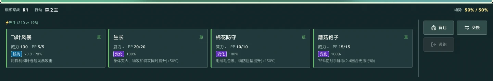

# Startup And PC Battle Controls

## Reported Problems

- The startup overlay remained above an already rendered game while artwork was downloading. The template dismissed it on `window.load`, which waits for pending image requests. Its status incorrectly claimed that trainer data was syncing.
- The battle panel had a fixed height shared by round information, tactical details, skills, and a wrapping action bar. Skill rows were compressed below their content height, clipping names and PP values.

## Changes

- Dismiss startup when the React interface commits. A stalled or failed image no longer blocks the game. Script failures show a retry action; a 15-second watchdog exposes retry during slow downloads without canceling a download that can still finish. Reload does not clear saves.
- Remove the separate 2.9 MiB startup background. Encode the home artwork as a 236,104-byte WebP, approximately 92% smaller than the original PNG.
- Split game data and vendor scripts into cacheable chunks. Content hashes invalidate changed scripts, while Netlify gives unchanged scripts an immutable cache policy. Relative URLs remain compatible with Electron and GitHub Pages.
- Use separate grid tracks for the battlefield and command panel. Basic four-skill battles use a compact panel; larger skill sets have more room and independent scrolling. Each skill has a fixed 116-pixel height with separate name, stats, forecast, and description rows.
- Put bag, switch, and other commands in a separate action column. Tactical details open above the panel, without reducing the skills' available height. Preserve disabled states, resource costs, accessible forecasts, and keyboard activation.
- Disable Netlify's injected branding badge through the site's supported setting so it cannot cover game controls.

## Verification

- Production build and 118 existing regression checks pass.
- With every image request stalled, create a trainer, select a partner, enter the map, save, reload, and continue with the same partner UID.
- Abort scripts, verify the error action, retry successfully, and retain local storage. Hold scripts for over 15 seconds, verify the slow-download action, release the requests, and enter normally.
- At a simulated 1 Mbps download rate and 150 ms latency with browser cache disabled, the production build reaches an interactive home in 9.8 seconds. This is a local controlled measurement, not a guarantee for every network or Netlify region.
- Verify the production file-protocol entry and mobile access restriction.
- Check battle control bounds and click targets at 1024x768, 1280x600, 1280x720, 1440x900, 1920x1080, and 2048x986. Verify bag, switch, keyboard skill activation, and turn resolution.
- Check an eight-skill fixture including equipment and jutsu skills, a long name, and insufficient-resource state at 1024x768, 1280x720, and 1920x1080. Every skill remains reachable through its own scroll area.
- Enter the two-versus-two dungeon through the UI. Verify both command slots, target selection, and the expanded tactical-intel layout with a controlled battle-state fixture.

